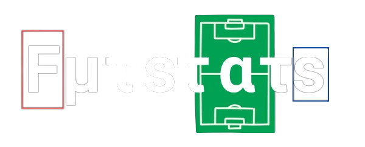
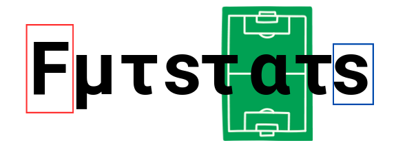

# Fμτsτατs



Football Statistics generator with Python

## Introduction

This Python code provides a basic statistic generator than can be use to asses the percentage of posession for each team, the heatmap of the ball and diferent players. It expandes the roboflow player object dection. Its is not perfect and was just intended as a fun personal project.

## Ball posession


https://github.com/user-attachments/assets/0469ca12-f196-405d-b315-5e2505b9b626


It uses a ```YOLOV8``` model to detect players in every frame, a tracking ```Bytrack``` model to asign a id to every player and a ```KNearestNeighbour``` algorithm to cluster the players in two teams based on the HSV of the object detection bounding box.

## Ball tracking


https://github.com/user-attachments/assets/759c6bb8-6488-4739-aa33-647700e69866


It uses the previous ```YOLOV8``` model to predict the ball and a new model to predict the keypoints of the football field needed to compute the homography matrix.

## Bird view


https://github.com/user-attachments/assets/4a81a6f2-9011-481f-864a-75a4da0b4f35


It uses the homography matrix to compute the bird view of the football field and the ball trajectory using some ```open-cv``` modules.


## Code structure

An overview of the code structure can be found [here](futstats/README.md)


## Instalation

- Clone ByteTrack
- Clone Yolov5
- Install project with :
```python
pip install -e .
```

## Usage

```python
python launch.py hsv-team-posession-tracking
```
or
```python
python launch.py ball-homography
```



