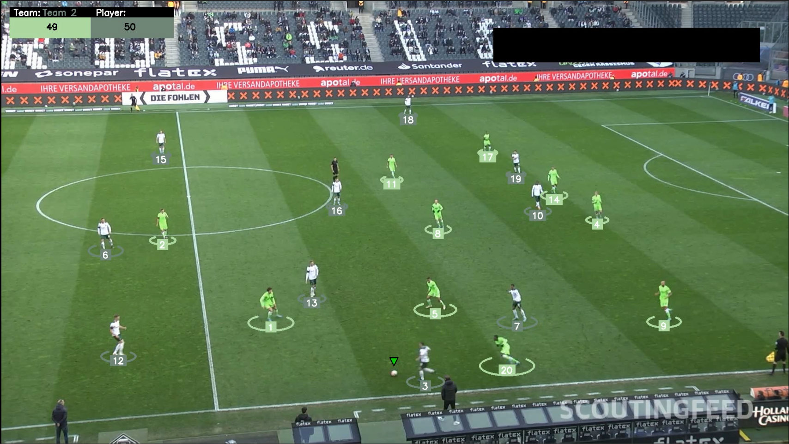
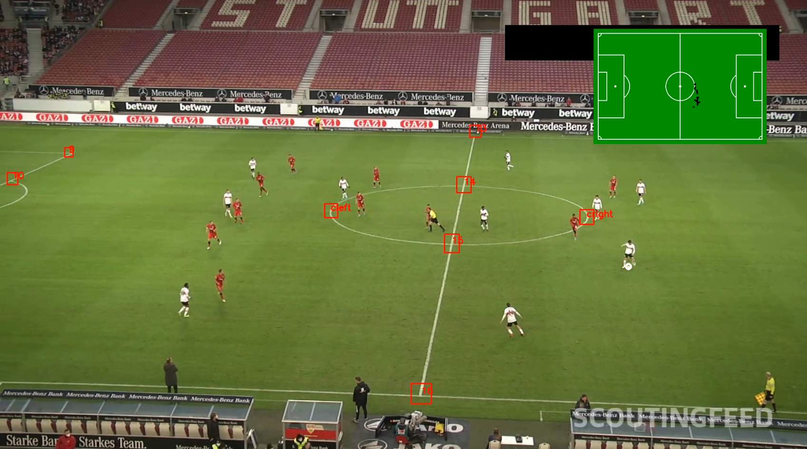
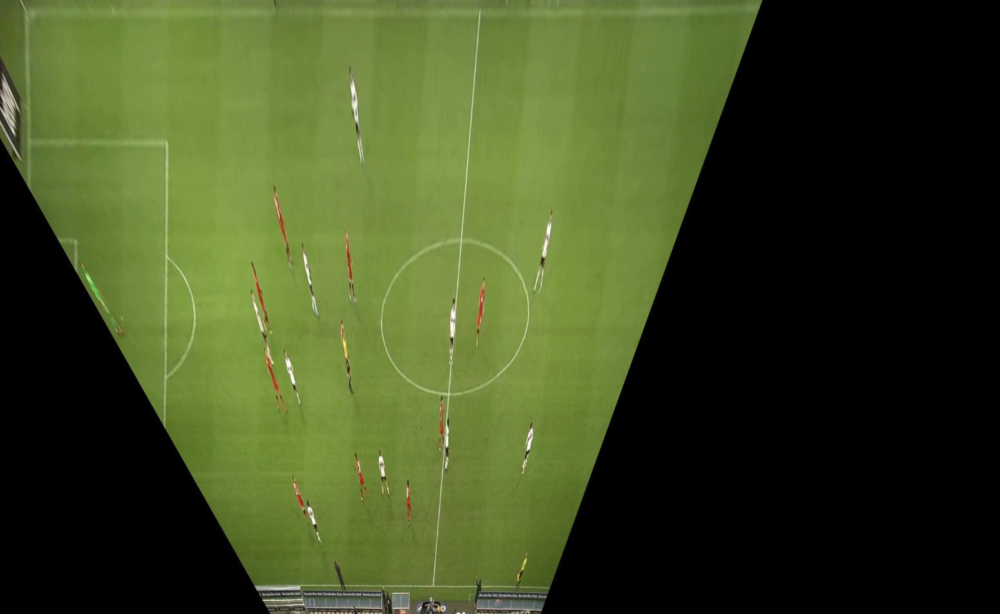

# Fμτsτατs


Football Statistics generator with Python

## Introduction

This Python code provides a basic statistics generator than can be use to asses the percentage of posession for each team, the heatmap of the ball and diferent players.

## Ball posession



It uses a ```YOLOV8``` model to detect players in every frame, a tracking ```Bytrack``` model to asign a id to every player and a ```KNearestNeighbour``` algorithm to cluster the players in two teams based on the HSV of the object detection bounding box.

## Ball tracking



It uses the previous ```YOLOV8``` model to predict the ball and a new model to predict the keypoints of the football field needed to compute the homography matrix.

## Bird view



It uses the homography matrix to compute the bird view of the football field and the ball trajectory using some ```open-cv``` modules.

## Structure of the code

Building....


